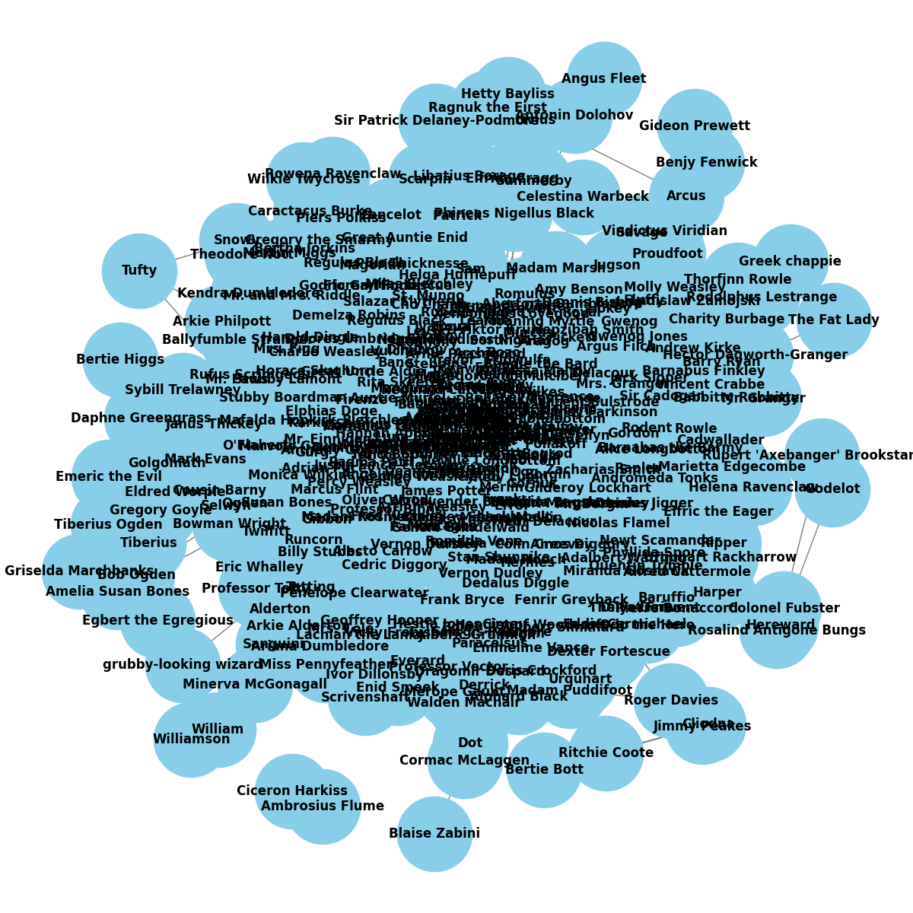
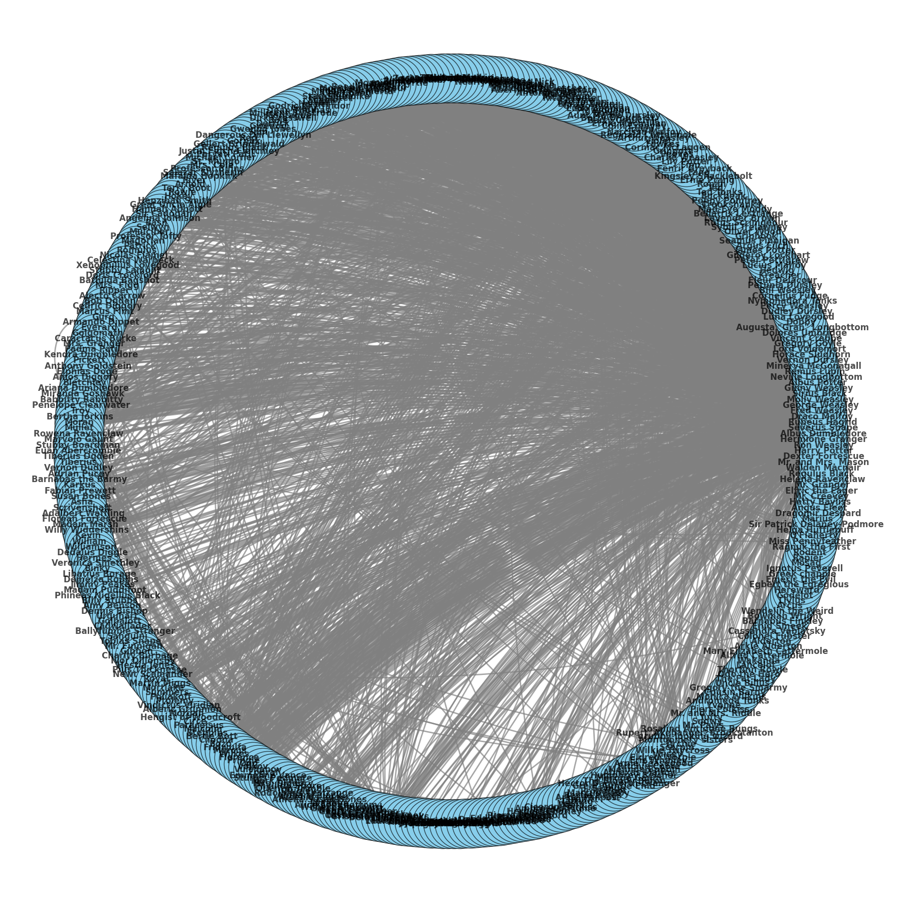
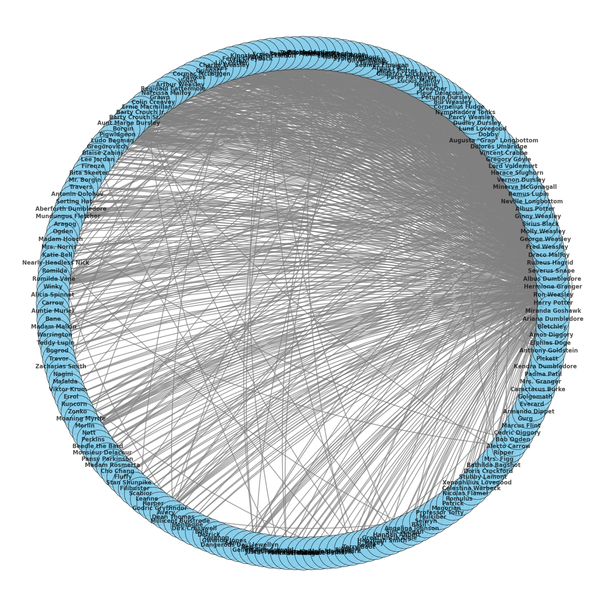
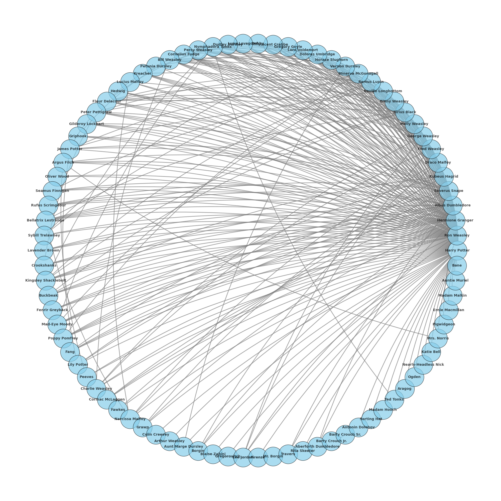
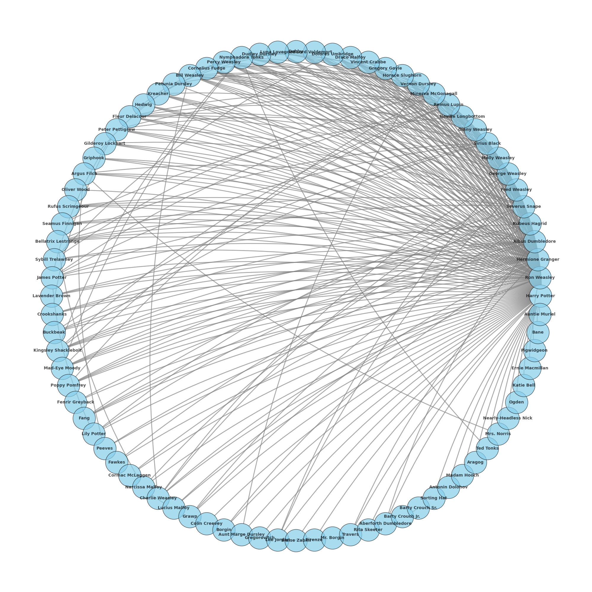

# Our Process

## 1. [Preprocess](#1-preprocess)
we begun by discussing what is the best way to preprocess our data. We decided to use the following steps:
1. Group by chapter to create data for whole chapters (currently divided aribtrarely)
2. Break down data to sentences, which will make it easier to later identify connections between characters

## 2. [Character Definition](#2-character-definition)
Since we want to identify relationships between characters, we will have to define what (or who) a character is. We decided to use outside data (from [Harry Potter Dataset](https://www.kaggle.com/datasets/zez000/characters-in-harry-potter-books) on kaggle) as well as our own book knowledge (we are our own domain experts!) to define characters.
We might encounter an issue with cases where a character is mentioned by a title (e.g. "the king") or a pronoun (e.g. "he"). We will have to decide how to handle these cases. We also have some issues related to surenames - for example, Weasly is a name for 7 distinct characters, as well as a general name for the whole family. We might tackle that problem by checking for a name in the sentence before and after.

We also consider using tfidf only on the names of the characters, to see if we can identify the most important characters in the book, and maybe use that to define the size the node they will have in the network.

## 3. [Network Creation](#3-network-creation)
We want:
1. create a simple graph where each character is a node, and an edge represents a connection. Initially, a connection is being mentioned in the same sentence.
2. Next, we would like to refine the definition of connection. Maybe a connection is talking directly to each other? Maybe being in the same physical space?
3. We also want to define positive and negative connections, and see if we can identify them.
4. We maybe want to define a directional connection - we could use that for pagerank later on. 

## 4. [Community Detection/ Page Rank](#4-community-detection-page-rank)

first attempt to plot character connections:

second attempt with different layout and...:

threshold for appearance in a sentence above 3 times:

adding threshold for characters that appears at least 14 times in the book
and for sentences that appear at least 10 times:

after filtering for special family names (weasley, potter, malfoy):

